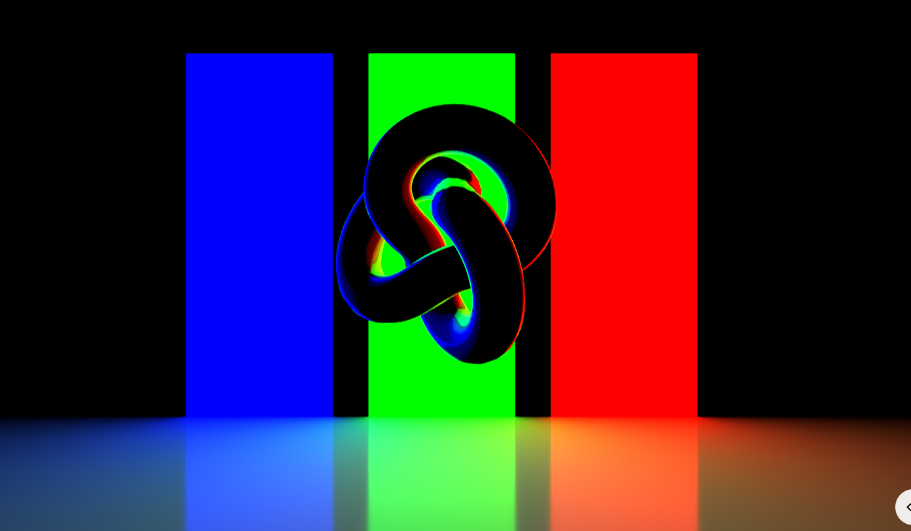

# week 8 quiz

## Part 1: Imaging Technique Inspiration

### The deep cyberpunk aesthetic showcased in the game Stray has significantly influenced the visual direction of this project. The use of vivid neon lighting effects, combined with intricate urban textures, creates an immersive atmosphere that draws viewers into a futuristic world. The dynamic interactions between creatures and robots further enhance the life-like quality of the scenes, adding layers of narrative and engagement. By incorporating contrasting colors and detailed environments, this project aims to emphasize key design elements, fulfilling the requirements for a complex visual representation. Ultimately, this approach provides a rich and imaginative visual experience that captivates and invites exploration.

#### Images 1

#### Images 2

## Part 2: Exploring Coding Techniques

### I chose to use the help of Three.js to create dynamic scenes with a sense of depth and light effects.

### Dynamic Lighting：The Three.js example uses RectAreaLight to create soft, even illumination, simulating neon signs crucial for the cyberpunk aesthetic.
#### Reference picture

#### Highlighting Details: Positioning the light strategically enhances the visibility of intricate textures on robots and creatures, making them stand out against darker backgrounds.
#### Complex Setup: Combining RectAreaLight with other light types (e.g., point and ambient lights) adds depth and realism to the scene.
#### User Interaction: Dynamically adjusting light properties based on user interactions enhances immersion.
#### To explore the code and see the project in action, visit the following link:

[Project Reference Link](https://gist.github.com/NeonBlueWS/fde2da512a61e2c55c00c4b8825f9705)
