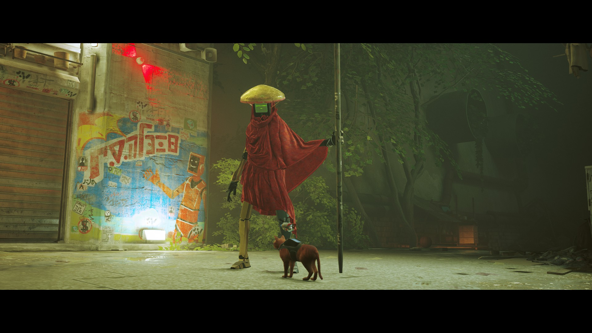
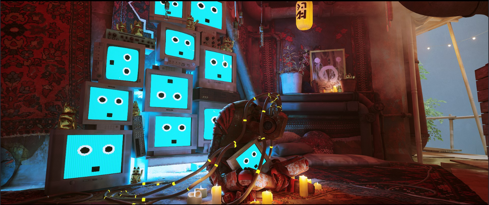

# week 8 quiz

## Part 1: Imaging Technique Inspiration

### Overview The deep cyberpunk aesthetic with vivid lighting and imaging effects in the Stray game captivated me. In particular, the neon lighting effects, the detailed urban textures, and the interactions between creatures and robots give the scenes a futuristic and life-like feel. I wanted to incorporate this cyberpunk atmosphere into my project to enhance the visual presentation and immersion. This technique is contrasting, highlights key elements of the project, fulfils the requirement for a complex visual representation in the assignment, and provides a rich and imaginative visual experience for the viewer.

#### Images 1

#### Images 2

## Part 2: Exploring Coding Techniques

### In order to achieve a cyberpunk-inspired visual effect, I chose to use the help of Three.js to create dynamic scenes with a sense of depth and light effects. Three.js provides a handy tool for creating futuristic cities and neon effects. This technology allows for light and shadow effects and complex geometries, perfectly reproducing the cyberpunk style. 

### To explore the code and see the project in action, visit the following link:

[Project Reference Link](https://gist.github.com/NeonBlueWS/fde2da512a61e2c55c00c4b8825f9705)
S