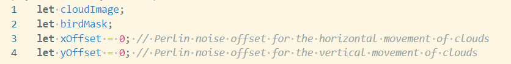

# Creative coding major project

## Personal Part: Perlin noise and randomness

### 1. Variable Declarations

#### Variable Declarations

##### cloudImage:This variable will store the image of the clouds.
##### birdMask: This is a graphics object (off-screen canvas) used to create the dove shape which will act as a mask on the cloud image.
##### xOffset and yOffset: These are used to control the smooth horizontal and vertical movement of the clouds using Perlin noise.
#### Preloading the Cloud Image

## Part 2: Exploring Coding Techniques

### I chose to use the help of Three.js to create dynamic scenes with a sense of depth and light effects.

#### Reference picture
![Reference picture]
### Dynamic LightingThe: Three.js example uses RectAreaLight to create soft, even illumination, simulating neon signs crucial for the cyberpunk aesthetic.
### Highlighting Details: Positioning the light strategically enhances the visibility of intricate textures on robots and creatures, making them stand out against darker backgrounds.
### Complex Setup: Combining RectAreaLight with other light types (e.g., point and ambient lights) adds depth and realism to the scene.
### User Interaction: Dynamically adjusting light properties based on user interactions enhances immersion.
### To explore the code and see the project in action, visit the following link:

[Project Reference Link](https://gist.github.com/NeonBlueWS/fde2da512a61e2c55c00c4b8825f9705)

[def]: images/Reference_pic.png