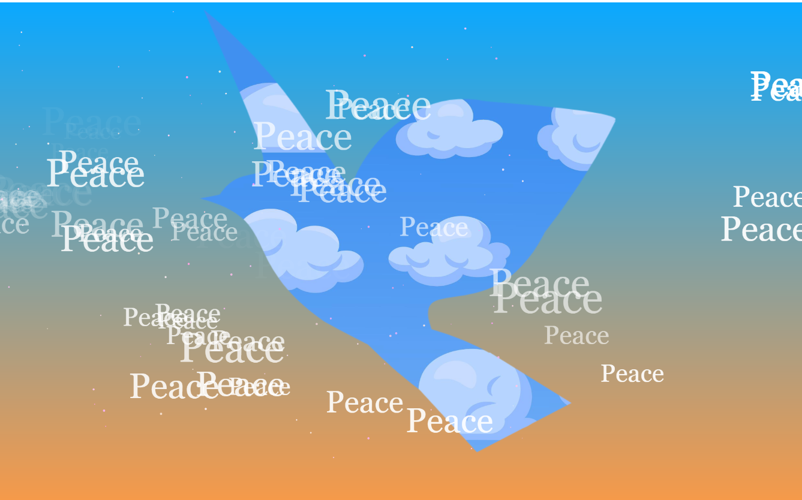

# Creative coding major project

## Personal Part: Perlin noise and randomness

### 1. Variable Declarations

##### - cloudImage:This variable will store the image of the clouds.
##### - birdMask: This is a graphics object (off-screen canvas) used to create the dove shape which will act as a mask on the cloud image.
##### - xOffset and yOffset: These are used to control the smooth horizontal and vertical movement of the clouds using Perlin noise.

### 2. Preloading the Cloud Image

##### - The preload() function is used to load the clouds.jpg image before the sketch begins. This ensures that the image is fully loaded and available to be used in the rest of the code.

### 3. Setup Function

#### - createCanvas(windowWidth, windowHeight) creates a canvas that spans the entire width and height of the browser window.
#### - createGraphics(500, 400) creates an off-screen graphics object (birdMask) with a fixed size of 500x400 pixels.
#### - drawDove(birdMask) is called to draw the dove shape on this off-screen canvas.
#### - cloudImage.mask(birdMask) applies the dove shape as a mask on the cloudImage, meaning the cloud image will be visible only in the shape of the dove.

### 4. Draw Function

#### - background(0, 100, 200) sets the background color to a blue shade.
#### - xMove and yMove are calculated using Perlin noise (noise(xOffset) and noise(yOffset)), which generates smooth, gradual random values for the movement of the cloud image. The map() function maps these values into a desired range for horizontal (-20 to 20) and vertical (-10 to 10) movement.
#### - xOffset and yOffset are incremented each frame (+= 0.01) to animate the cloud movement smoothly.
#### - cloudOpacity adjusts the transparency of the cloud image based on the vertical position of the mouse (mouseY). As the mouse moves down the screen, the clouds become more opaque.
#### - scaleFactor calculates the scaling factor to ensure the dove shape fits proportionally within the canvas size, keeping it centered and scaled correctly.
#### - image(cloudImage, ...) draws the cloud image on the canvas, with adjustments for opacity, position, and scaling.

### 5. Drawing the Dove Shape

#### -This function draws the dove shape on the pg graphics object (birdMask).
#### -The dove is drawn using Bezier curves (bezierVertex), which are useful for creating smooth, flowing lines. The coordinates provided in the vertex() and bezierVertex() functions define the shape of the dove's body, wings, head, and tail.
#### -beginShape() and endShape(CLOSE) start and end the shape, respectively, with CLOSE making sure the path is closed to form a complete dove.
#### -The tail of the dove is drawn in a separate shape at the end.

### 6. Handling Window Resize

#### - This function ensures that the canvas size is updated whenever the window is resized, so the sketch will adjust dynamically to fit the new window dimensions.

Technical reference sources used:
p5.js. “map() Function.” p5.js Reference.[https://p5js.org/reference/#/p5/map]

[def]: assets/clouds.jpg